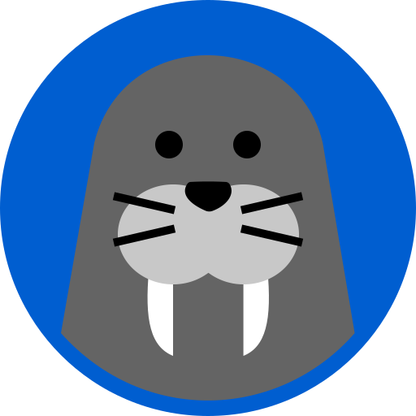

<a name="readme-top"></a>

<div align="center">
  
  <br/>

  <h3><b>MORSE PARSER</b></h3>

</div>

# 📗 Table of Contents

- [📖 About the Project](#about-project)
  - [🛠 Built With](#built-with)
    - [Tech Stack](#tech-stack)
    - [Key Features](#key-features)
- [💻 Getting Started](#getting-started)
  - [Setup](#setup)
  - [Prerequisites](#prerequisites)
  - [Usage](#usage)
- [👥 Authors](#authors)
- [🔭 Future Features](#future-features)
- [🤝 Contributing](#contributing)
- [⭐️ Show your support](#support)
- [🙏 Acknowledgements](#acknowledgements)
- [📝 License](#license)

# 📖 MORSER PARSE <a name="about-project"></a>
**Morse Parser** is a decoder that can analyze a string of symbols in morse code and convert it to text.

## 🛠 Built With <a name="built-with"></a>

### Tech Stack <a name="tech-stack"></a>

This project was implemented using:

<details>
  <summary>Client</summary>
  <ul>
    <li><a href="https://www.ruby-lang.org/en/documentation/">Ruby</a></li>
  </ul>
</details>

### Key Features <a name="key-features"></a>

- **Can decode a morse code string**
- **Command line app**
- **Easy to use**

<p align="right">(<a href="#readme-top">back to top</a>)</p>

## 💻 Getting Started <a name="getting-started"></a>

To get a local copy up and running, follow these steps.

### Prerequisites <a name="prerequisites"></a>

In order to run this project you need to have installed:

- [ ] You’ll need to have Ruby on your machine.

Optionally, in order to modify this project you should to have installed:

- [ ] Git.

- [ ] Code editor like: [Visual Studio code](https://code.visualstudio.com/), [Sublime text](https://www.sublimetext.com/) or others...

### Setup <a name="setup"></a>

To clone this repository to your desired folder:

- You can download the **Zip** file from the GitHub repository, or clone the repository with:

```console
git clone https://github.com/paulsaenzsucre/morse-parser.git
```

- Access the cloned directory with:

```console
cd morse-parser
```

- Open it with your favorite code editor or with the live server

### Usage <a name="usage"></a>

To run the project, execute the following command in the project directory:

```console
ruby parser.rb
```
## 👥 Authors <a name="authors"></a>

👤 **Birhanu Gudisa**

- GitHub: [@GutemaG](https://github.com/GutemaG)
- Twitter: [@birhanugudisa3](https://twitter.com/birhanugudisa3)
- LinkedIn: [birhanugudisa](https://linkedin.com/in/birhanugudisa)

👤 **Paul Sáenz Sucre**

- GitHub: [@paulsaenzsucre](https://github.com/paulsaenzsucre)
- Twitter: [@paulsaenzsucre](https://twitter.com/paulsaenzsucre)
- LinkedIn: [LinkedIn](https://www.linkedin.com/in/paulsaenzsucre)

<p align="right">(<a href="#readme-top">back to top</a>)</p>

## 🔭 Future Features <a name="future-features"></a>

We will implement this on the future:

- [ ] **Decode a morse code as is entered by keyboard**

<p align="right">(<a href="#readme-top">back to top</a>)</p>

## 🤝 Contributing <a name="contributing"></a>

Contributions, issues, and feature requests are welcome!

Feel free to check the [issues page](../../issues/).

<p align="right">(<a href="#readme-top">back to top</a>)</p>

## ⭐️ Show your support <a name="support"></a>

Give a ⭐️ if you like this project!

<p align="right">(<a href="#readme-top">back to top</a>)</p>

## 🙏 Acknowledgments <a name="acknowledgements"></a>

- Hat tip to anyone whose code was used.
- Thanks for all the curated content that was provided to us.
- Thanks to my learning and coding partners for all their support.

<p align="right">(<a href="#readme-top">back to top</a>)</p>

## 📝 License <a name="license"></a>

This project is [MIT](./LICENSE) licensed.

<p align="right">(<a href="#readme-top">back to top</a>)</p>